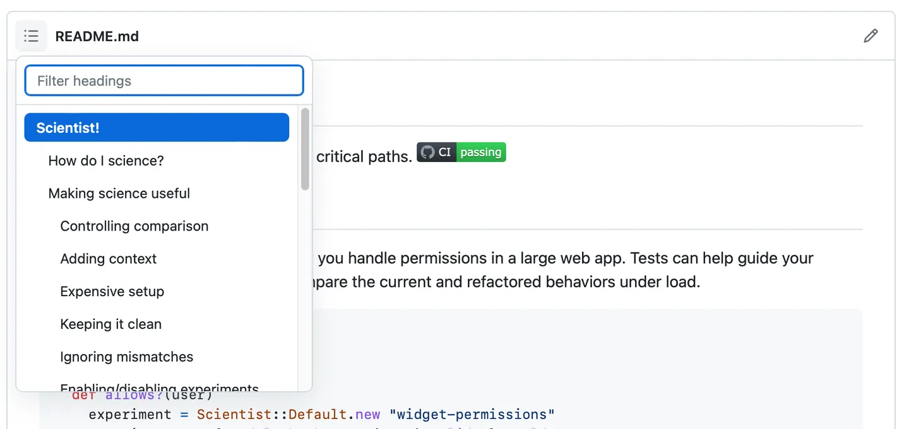
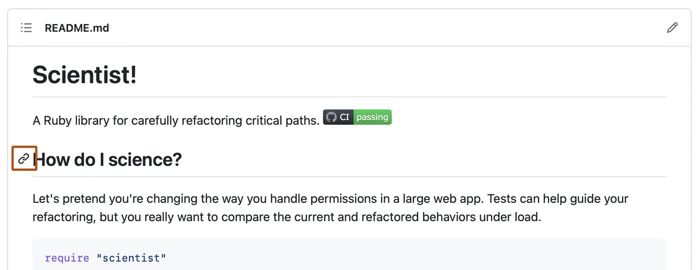

**Создаю репозиторий на GitHub**

# О файлах README 

**Можно добавить файл сведений в репозиторий, чтобы сообщить другим людям, чем полезен проект, что они могут с ним делать и как его использовать.**

# About READMEs #

You can add a README file to a repository to communicate important information about your project. A README, along with a repository license, citation file, contribution guidelines, and a code of conduct, communicates expectations for your project and helps you manage contributions.

For more information about providing guidelines for your project, see "Adding a code of conduct to your project" and "Setting up your project for healthy contributions."

A README is often the first item a visitor will see when visiting your repository. README files typically include information on:

* What the project does
* Why the project is useful
* How users can get started with the project
* Where users can get help with your project
* Who maintains and contributes to the project

If you put your README file in your repository's hidden .github, root, or docs directory, GitHub will recognize and automatically surface your README to repository visitors.

If a repository contains more than one README file, then the file shown is chosen from locations in the following order: the .github directory, then the repository's root directory, and finally the docs directory.

If you add a README file to the root of a public repository with the same name as your username, that README will automatically appear on your profile page. You can edit your profile README with GitHub Flavored Markdown to create a personalized section on your profile. For more information, see ["Managing your profile README."](https://docs.github.com/en/account-and-profile/setting-up-and-managing-your-github-profile/customizing-your-profile/managing-your-profile-readme)

# Auto-generated table of contents for README files

For the rendered view of any Markdown file in a repository, including README files, GitHub will automatically generate a table of contents based on section headings. You can view the table of contents for a README file by clicking the  menu icon at the top left of the rendered page.



# Section links in README files and blob pages

You can link directly to a section in a rendered file by hovering over the section heading to expose



# Relative links and image paths in README files

You can define relative links and image paths in your rendered files to help readers navigate to other files in your repository.

A relative link is a link that is relative to the current file. For example, if you have a README file in root of your repository, and you have another file in *docs/CONTRIBUTING.md*, the relative link to *CONTRIBUTING.md* in your README might look like this:

```
[Contribution guidelines for this project](docs/CONTRIBUTING.md)
```
GitHub will automatically transform your relative link or image path based on whatever branch you're currently on, so that the link or path always works. The path of the link will be relative to the current file. Links starting with / will be relative to the repository root. You can use all relative link operands, such as ./ and ../.